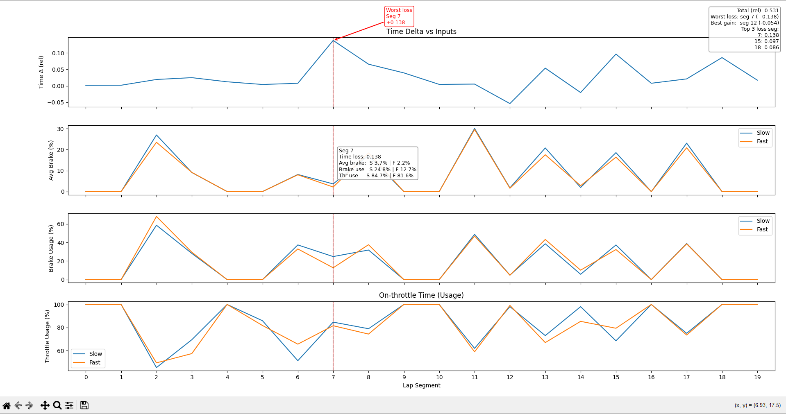

# Lap Time Analysis – Braking & Throttle Behavior

> A motorsport telemetry analysis and visualization tool for comparing driver inputs and lap time deltas.


This project analyzes and visualizes lap telemetry data to understand **where time is gained or lost** between a fast lap and a slower lap.

The focus is on **driver inputs** (brake and throttle) and how they correlate with **relative lap time delta**, broken down into equal lap segments.

The tool provides:
- Segment-by-segment time loss / gain
- Average brake pressure and brake usage
- On-throttle usage
- Interactive hover inspection with synchronized cursor
- Automatic highlighting of the worst time-loss segment

This is designed for **motorsport telemetry analysis**, sim racing data, or real-world data exported from tools such as Garage61.

---

## Features

- Segments the lap into equal portions (default: 20)
- Compares **fast vs slow lap**
- Highlights:
  - Worst time-loss segment
  - Best time-gain segment
- Interactive plot:
  - Shared vertical cursor across all plots
  - Hover box showing exact values per segment
- Clear visual comparison of braking and throttle behavior

---

## Project Structure

```
lap-time-analysis/
│
├── data/
│   ├── lap_fast.csv
│   └── lap_slow.csv
│
├── src/
│   └── analyze_laps.py
│
├── requirements.txt
└── README.md
```

---

## Data Requirements

The script expects **two CSV files** located in the `data/` directory:

```
data/lap_fast.csv
data/lap_slow.csv
```

Each CSV must contain at minimum the following columns:

- `LapDistPct` — normalized lap distance (0.0 → 1.0)
- `Speed` — vehicle speed (units are relative)
- `Brake` — brake input (0.0 → 1.0)
- `Throttle` — throttle input (0.0 → 1.0)

Additional columns are ignored.

---

## Setup & Installation

It is recommended to use a virtual environment.

### Create and activate a virtual environment

```bash
python -m venv .venv
source .venv/bin/activate    # macOS / Linux
# .venv\Scripts\activate     # Windows
```

### Install dependencies

```bash
pip install -r requirements.txt
```

---

## Usage

From the project root:

```bash
python src/analyze_laps.py
```

An interactive matplotlib window will open showing:

- Time delta per segment
- Average brake pressure
- Brake usage percentage
- Throttle usage percentage

Hover over any segment to inspect values across all plots simultaneously.

---

## Notes & Limitations

- Time delta is **relative**, not absolute lap time
- Intended for **comparison**, not exact lap timing
- Segment count can be adjusted in the script
- Assumes monotonic `LapDistPct` data

---

## Future Improvements

- Corner-based segmentation
- Sector detection
- Steering angle analysis
- Gear usage analysis
- Export plots as images
- Save per-segment statistics to CSV

---

## Motivation

This project was built to replicate that workflow using telemetry data,
highlighting where braking and throttle behavior contribute to time loss or
gain, with an emphasis on visualization and decision support rather than
full vehicle physics modeling.

---

## Example Insight

In the analyzed dataset, the largest time loss occurred in **segment 7**, where
the slower lap showed higher brake usage and reduced throttle application
compared to the faster lap. This behavior is consistent with an inefficient
corner entry-to-exit transition and mirrors real-world performance engineering
analysis.

---

## Example Output



---

## Author

**Isaiah Alvarado-Ramirez**  
Computer Science (AI) – UNC Charlotte  
Motorsport telemetry & data analysis
